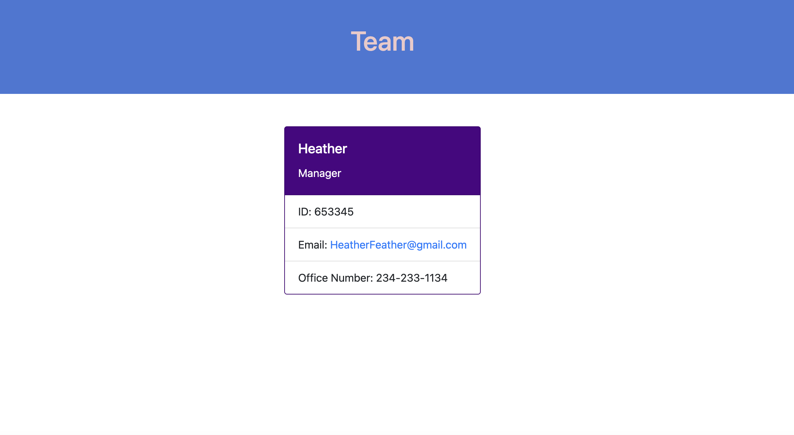

# 10 Object-Oriented Programming: Team Profile Generator

My task is to build a Node.js command-line application that takes in information about employees on a software engineering team, then generates an HTML webpage that displays summaries for each person. Testing is key to making code maintainable, so you’ll also write a unit test for every part of your code and ensure that it passes each test.

Because this application won’t be deployed, I have provided a link to a walkthrough video that demonstrates its functionality and all of the tests passing.

You can view it here: https://drive.google.com/file/d/19GVqvPszCGJyMgn95NxQZI90zErYDg1W/view

Embed code for the video walkthrough: <iframe src="https://drive.google.com/file/d/19GVqvPszCGJyMgn95NxQZI90zErYDg1W/preview" width="640" height="480"></iframe>

The following image shows a mock-up of the generated HTML’s appearance and functionality:

